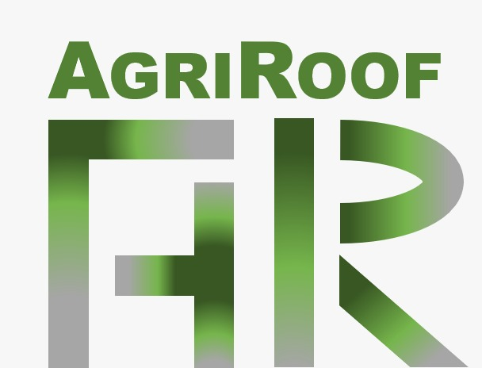

```{r setup, include=FALSE}
knitr::opts_chunk$set(echo = TRUE)
```
## Framework


The app was developed as a final project for the Land and Water Management Course  [04-GEO-APP2](http://eagle-science.org/project/app2-land-and-water-management/), which is one of the courses that we took during the second semester of our [MSc. in Applied Earth Observation and Geoanalysis (EAGLE)](http://eagle-science.org/) at [JMU Wuerzburg](https://www.uni-wuerzburg.de/en/home/).

This application is governed by the
[](http://www.gnu.org/licenses/gpl-3.0)

You can use, modify and/or redistribute these codes under the terms of the GPL v3 license
This Shiny application requires the following packages: 

  - Shiny, Chang et al. (2020)
  - shinydashboard, Chang et al. (2018)
  - shinycssloaders, 	Andras Sali et al. (2020)
  - leaflet, Joe Cheng et al. (2019)
  - leaflet.extras, Bhaskar Karambelkar et al. (2018)
  - widgetframe, Bhaskar Karambelkar et al. (2017)
  - plotly, Carson Sievert et al. (2020).
  - rgdal, Roger Bivand et al. (2020)
  - raster, Robert J. Hijmans et al. (2020)
  - mapview, Tim Appelhans et al. (2020)
  - plainview, Tim Appelhans and Stefan Woellauer, (2020)
  - ggplot2, Hadley Wickham et al. (2020)
  - tidyverse, Hadley Wickham, (2019)
  
## Contact:
#### AgriRoof Team:

  - Andreas Bury: Project Manger: andreas.bury@stud-mail.uni-wuerzburg.de [LinkedIn](https://www.linkedin.com/in/andreas-bury-19081a19a/)
[GitHub](https://github.com/Ioadidaiz).

  - James Bruckheimer: Market and Business  Researcher: james.brueckheimer@stud-mail.uni-wuerzburg.de
[LinkedIn](https://www.linkedin.com/in/james-br??ckheimer-b1696a1b5/)
[GitHub](https://github.com/JamesBrueckheimer).

  - Sofia Garcia: Earth Observation Technical Researcher: andrea_sofia.garcia_de_leon@stud-mail.uni-wuerzburg.de
[LinkedIn](https://www.linkedin.com/in/asofia-garcia/)
[GitHub](https://github.com/sofigdl).  

  - Kevin Yomi: Earth Observation Technical Researcher: 
  
  - Walid Ghariani: Earth Observation Programmer: 
walid.ghariani@stud-mail.uni-wuerzburg.de [LinkedIn](https://www.linkedin.com/in/walid-ghariani-893365138/) [GitHub](https://github.com/WalidGharianiEAGLE).


### References:

Chang et al.  2020. Shiny: Web Application Framework for R. <https://cran.r-project.org/web/packages/shiny/index.html>.

Chang et al. 2018. Shinydashboard: Create Dashboards with 'Shiny'. <https://cran.r-project.org/web/packages/shinydashboard/index.html>.

Andras Sali et al. 2020. shinycssloaders: Add Loading Animations to a 'shiny' Output While It's Recalculating. <https://cran.r-project.org/web/packages/shinycssloaders/index.html>.

Joe Cheng et al. 2019. leaflet: Create Interactive Web Maps with the JavaScript 'Leaflet' Library. <https://cran.r-project.org/web/packages/leaflet/index.html>.

Bhaskar Karambelkar et al. 2018. leaflet.extras: Extra Functionality for 'leaflet' Package. <https://cran.r-project.org/web/packages/leaflet.extras/index.html>.

Bhaskar Karambelkar et al. 2017. widgetframe: 'Htmlwidgets' in Responsive 'iframes'. <https://cran.r-project.org/web/packages/widgetframe/index.html>.

Carson Sievert et al. 2020. plotly: Create Interactive Web Graphics via 'plotly.js'. <https://cran.r-project.org/web/packages/plotly/index.html>.

Roger Bivand et al. 2020. rgdal: Bindings for the 'Geospatial' Data Abstraction Library. <https://cran.r-project.org/web/packages/rgdal/index.html>.

Robert J. Hijmans et al. 2020. raster: Geographic Data Analysis and Modeling. <https://cran.r-project.org/web/packages/raster/index.html>.

Tim Appelhans et al. 2020, mapview: Interactive Viewing of Spatial Data in R. <https://cran.r-project.org/web/packages/mapview/index.html>.


Tim Appelhans and Stefan Woellauer, 2020. plainview: Plot Raster Images Interactively on a Plain HTML Canvas.
<https://cran.r-project.org/web/packages/plainview/index.html>.

Hadley Wickham et al. 2020. ggplot2: Create Elegant Data Visualisations Using the Grammar of Graphics.
<https://cran.r-project.org/web/packages/ggplot2/index.html>.

Hadley Wickham, 2019, tidyverse: Easily Install and Load the 'Tidyverse' tidyverse. 
<https://cran.r-project.org/web/packages/tidyverse/index.html>.